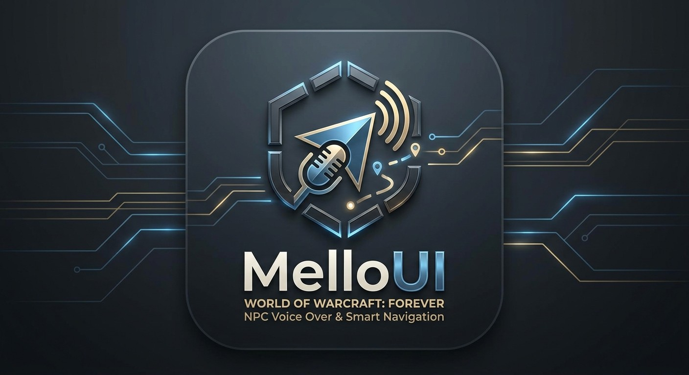
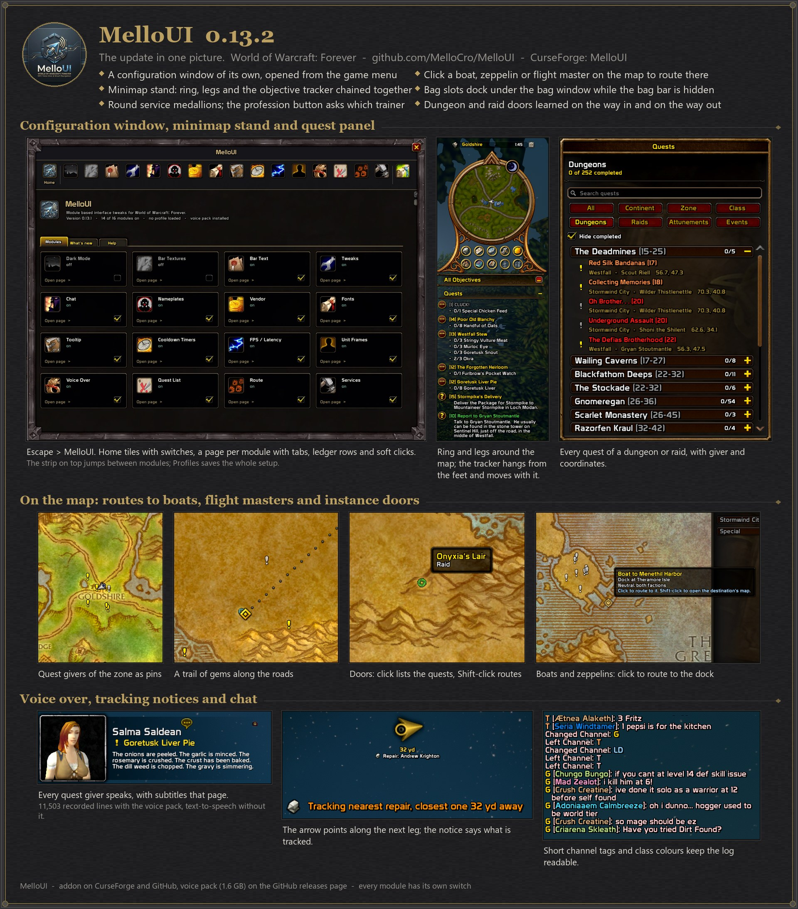

<p align="center"></p>

# MelloUI

Module based UI addon for **World of Warcraft: Forever** (beta 1.60.1, interface `16001`).

**Download:** [MelloUI addon (latest release)](https://github.com/MelloCro/MelloUI/releases/latest) · [on CurseForge](https://www.curseforge.com/wow/addons/melloui)
· [MelloUI VoiceOver Data (optional voice pack, 1.6 GB)](https://github.com/MelloCro/MelloUI/releases/download/v0.13.0/MelloUI_VoiceOverData.zip)
· [all releases](https://github.com/MelloCro/MelloUI/releases)

**Every quest giver in Azeroth talks to you.** MelloUI reads quest offers, progress and
completion text and greetings aloud, in a voice that matches the NPC's race and gender:
dwarves sound like dwarves, trolls like trolls, gnomes like gnomes. A portrait overlay shows
the speaking NPC with its talk animation, the line being read, the queue of what comes next,
and subtitles that page with the speech. With the **MelloUI VoiceOver Data** pack installed
you get **11,521 recorded lines**: the vanilla quest offers and turn-ins of the wow-voiceover
project (most of them: the progress lines, what a giver says when you come back unfinished,
were largely never recorded), the vanilla greetings, and Forever's own new quests. Whatever has
no recording is read by the client's text-to-speech voices, still race and gender matched, so
it works from the first minute, and `Tools\export_vanilla_lines.py` lists every missing vanilla
line for the generator. A Read button in the quest log
reads any quest you accepted long ago, in its giver's voice, followed by the objectives with
your current progress.

Around that: a quest list on the map with givers, turn-ins, dungeon doors and docks, routes
that learn the roads you walk, nearest-service routing, dark mode, bar textures, fonts, chat,
nameplate, tooltip and cooldown tweaks, and settings profiles. Every module can be switched
off on its own.

<p align="center"></p>

Forever runs the retail (Midnight era, 12.1.x) API and the Dragonflight style HUD with
Camelot specific overrides. This addon targets exactly that client; frame keys were taken
from the `forever` branch of the Blizzard UI source.

## Install

Download the latest release (or clone this repository) and copy the `MelloUI` folder to:

```
<World of Warcraft>\_classic_beta_\Interface\AddOns\MelloUI
```

Then `/reload` in game. The configuration window has its own **MelloUI** button in the game
menu (Escape), or type `/mello`. It is a standalone WoW styled window with a page per module,
not an entry under Options > AddOns. The first start applies the bundled default profile (see
*Profiles*).

### Installing the voice pack (1.6 GB, optional but recommended)

The recorded lines come as a separate addon, hosted on GitHub because of its size.

**Direct download:** https://github.com/MelloCro/MelloUI/releases/download/v0.13.0/MelloUI_VoiceOverData.zip

1. Download the zip (1.6 GB).
2. Unzip it. You get one folder named `MelloUI_VoiceOverData`.
3. Move that folder into your AddOns folder, next to MelloUI:
   `World of Warcraft\_classic_beta_\Interface\AddOns\MelloUI_VoiceOverData`
   The folder must contain `MelloUI_VoiceOverData.toc` directly, not another folder inside.
4. Start the game (restart it if it was running), open the AddOns list at the character
   screen and tick **MelloUI VoiceOver Data**.
5. In game, `/vo packs` lists the pack with 11,521 lines and, after a dialog, how each line
   was found. Talk to any quest giver and you will hear the recorded line.

The pack merges the vanilla lines of the wow-voiceover project (Unlicense) with the lines
generated for Forever's own quests. If you had `AI_VoiceOverData_Vanilla` installed before,
remove it: the pack already contains all of its lines.

## First login and the tour

A fresh install starts with **every module off**: the built-in "Everything Off" profile is
the default for an install with no settings (see *Profiles*), so nothing changes until you
switch it on. Switching UI Modifications on (or its "Painted kit reskin" toggle) brings the full
reskin, switches Custom Sounds on with it, and puts the Edit Mode layout the reskin is drawn for
into Edit Mode as the account layout "MelloUI", made active (action bars, side bars, reputation
bar, unit and party frames, the two end caps); the quality-of-life tweaks stay off until you
want them. The first time you log in, one of the game's own dialogs says so and asks
whether to take a short tour of the settings window. The tour runs on the game's help tips:
sixteen steps, each pointing at the part of the window it is about, from the icon strip and
the module tiles through UI Modifications, Unlock the Windows and the tweak tabs to Voice Over,
Quest List, Route, Services, Party Markers, Custom Sounds and its Preview tab, Profiles and
What's new. It is always there again as the Tutorial button on
the window's Home page or `/mello tutorial`. (The game's help tips must be on: Options,
Gameplay, Help.)

## Settings storage on the Forever beta

The beta client (build 1.60.1.69913) does not reliably load addon saved variables from disk.
MelloUI therefore mirrors every non-default setting into a few hidden account macros named
`MelloUI1`, `MelloUI2`, ... and restores from them whenever the saved variables are missing.
Do not delete those macros. The regular saved-variables file is still written and used when
the client does load it.

## Known issues

- The beta client does not reliably read saved variables back, so the settings live in the
  macro backup described above. Deleting those macros returns the addon to the default profile.
- Instances new to Forever have no entrance data in the client. Their doors appear on the map
  after the first visit (learned on the way in or on the way out) or with `/qlmap entrance`.
- Route draws a straight guess where no road has been learned yet. Walking the way once
  teaches it, and `Tools\bake_routes.py` ships what was learned with the next release.
- Voice Over lines without a recording are read by Windows text-to-speech, which needs a
  voice installed in the Windows speech settings.
- Dark Mode only recolours textures (the combat secret-values rules forbid the rest), so
  frames drawn without textures keep their colours.
- New files listed in the TOC need a full client restart; a `/reload` is not enough.

## Profiles

The MelloUI settings have a **Profiles** page. "Save current as" stores every setting of every
module under a name; Load replaces all settings with a profile; "Set default" marks the one
that is applied when the addon starts with no settings at all, such as on a fresh install or
when neither the saved variables nor the macro backup brought anything back; out of the box
that is the built-in **Everything Off** profile (every module off, made from the module list
at each login, so it cannot be deleted or overwritten). Profiles are
kept in the saved variables, which this client writes at `/reload` but does not read back, so
`Tools\bake_routes.py --watch` (the same watcher that keeps the learned roads) bakes them into
`Media\Profiles.lua` after each `/reload`; the page shows whether a profile is baked yet. Only
values that differ from the defaults are stored, so a profile is a few hundred bytes.
`/mello profile` does the same from chat.

## Slash commands

| Command | Effect |
| --- | --- |
| `/mello` | open (or close) the MelloUI configuration window; also the MelloUI button in the game menu |
| `/mello <module>` | open the window on that module's page |
| `/mello list` | list modules and their on/off state |
| `/mello enable <module>` | enable a module |
| `/mello disable <module>` | disable a module |
| `/mello dump [module]` | print the stored settings |
| `/mello status` | whether the client loaded the saved variables, where the settings in use came from, and the state of the macro backup |
| `/mello profile ...` | `save <name>`, `load <name>`, `delete <name>`, `default <name>` or `default none`, `list` (see *Profiles*) |
| `/mello cpu` | CPU time per handler and hook of every module since login (needs `/console scriptProfile 1` and a `/reload`); `/mello cpu reset` zeroes the counters |
| `/mello help` | the command list in chat |
| `/mello tutorial` | the guided tour of the settings window (also the Tutorial button on its Home page) |
| `/mello layout` | the Edit Mode layout the reskin is drawn for: `apply` puts it into Edit Mode as the account layout "MelloUI" and makes it active (done once by itself when the reskin is switched on), `export` prints the active layout's share string for baking into `Media\EditModeLayout.lua` |
| `/mellolog [clear]` | the copy window with what the dump commands logged (`clear` empties it) |
| `/vo ...` | Voice Over: `stop`, `pause`, `skip`, `test`, `voices`, `npc`, `packs`, `lines`, `reset` |
| `/qlmap` | Quest List map pins: diagnostics, and `dock`, `zeppelin`, `arrive`, `entrance`, `remove`, `list` to record pins by hand (see Quest List) |
| `/route` | Route: how much has been learned and the current route; `/route quest` (what the client reports for the tracked quest), `/route clear`, `/route arrow reset`, `/route reset confirm`, `/route dots` (the route painters, for the copy window) |
| `/services [kind]` | Services: open the nearest-service menu, or route straight to the nearest `repair`, `mailbox`, `innkeeper`, `flight`, `auction`, `bank`, `class trainer`, `profession trainer`, `barber` or `transmog` |
| `/sfx` | Custom Sounds: the state; `/sfx play <name>` auditions a sound, `/sfx list` names them, `/sfx log` prints every sound kit the game plays and what replaced it, `/sfx kit <id>` what a kit maps to; `/sfxdump` the last sound events in the copy window |
| `/kitwhat` | every kit texture under the mouse cursor, back to front: the piece, its size, its crop, its tint, the frame it is on (for a background that is not the one expected) |
| `/xxdump` | every painted window and HUD area has a dump command that logs its frames to the copy window: `/cpdump` (character), `/sbdump`, `/profdump`, `/legdump`, `/taldump`, `/mapdump`, `/gfdump`, `/gdump` (guild), `/coldump`, `/socdump`, `/ufdump`, `/cbdump`, `/rfdump`, `/abdump`, `/bagdump`, `/mmdump`, `/trdump`, `/chdump`, `/dmdump`, `/ttdump`, `/npdump`, `/huddump`, `/kitdemo` |

## Modules

### Dark Mode

Darkens the Blizzard artwork by desaturating and tinting the frame textures. No layout is
changed, so Edit Mode keeps working and nothing secure is touched.

Components (each with its own toggle): unit frames, cast bars, action bars, action bar end
caps (gryphons), nameplates, personal resource display, experience/reputation/honor bars,
cooldown manager, micro menu and bag bar, minimap, chat frame, buffs and
debuffs. Extra options: brightness, desaturate, aura icon border, keep dispel
colours on debuff borders.

### Bar Textures

Swaps the fill texture of health and power bars (player, target, focus, pet, party, boss,
target-of-target), raid-style party and raid frames, nameplate health and cast bars, the personal resource display, the
experience / reputation / honor bars, cast bars and the cooldown manager bars. Ships with
Flat, Smooth, Gloss and Minimalist textures, lists the two Blizzard bar textures and any
LibSharedMedia status bar textures, and reads custom files from `Media\Textures` listed in
`Media\CustomTextures.lua`. Colours that Blizzard baked into its atlases (power types,
experience, reputation, cast states) are re-applied so bars keep their meaning.

### Chat

- Move the input box above the chat window.
- Hide the chat window background and border art, the input box art, the buttons next to
  the chat, and optionally the
  tab background.
- Short, saturated channel tags: G for Guild (green), P for Party, R for Raid, RW for Raid
  Warning, W for whispers, and G, T, LD, WD, LFG for the numbered channels. Brackets can be
  removed as well.
- Class coloured player names in every chat type through Blizzard's own override CVar.

### Names

Characters on this client have a first name and a surname. UI Modifications has one "Show Names
As" dropdown (its Names tab): first name, last name, or both, for everything at once: the player,
target, focus, pet, party and raid frames, the nameplates, and the name over your own head. The
frames' text is re-set after the game sets it (post-hooks on `UnitFrame_Update` and
`CompactUnitFrame_UpdateName`, in the Unit Frames and Nameplates modules); the name over your own
head is the client's own `UnitSurnameOwn` setting (surname on or off, so "Last name" shows both
there; the setting is put back when the module is off). A character with no surname shows the name
it has, and a name the client keeps secret (nameplates inside instances) is shown as the game shows
it. Other players' names drawn over their heads without a nameplate are the engine's: the client
has no setting for their form, so they always show first and last name; turn nameplates on to see
them in the chosen form.

### Nameplates

Moves the crowd-control icon on enemy nameplates from the right side to above the name
(above the debuff row when there is one) and scales it up, 45 px by default. Also enlarges
the loss-of-control icon on enemy player nameplates the same way. Blizzard's own "Crowd
Control" nameplate aura option must be on. Also adds a yellow quest marker left of the health
bar on enemies that still count for an unfinished quest objective (Forever's default
nameplates have no quest icon), read from the unit tooltip data.

### Tweaks

- Hide the micro menu and/or the bag bar. They come back while Edit Mode is open so they can
  still be moved.
- With the bag bar hidden, the bag slots dock under the open bag window (combined or separate
  bags) so bags can still be equipped and removed. Off switch: "Bag Slots on Bag Window".
- Hide the player coordinates the client writes under the minimap ("Hide Minimap
  Coordinates", on by default).
- "Chat Notices" (on by default) covers the lines MelloUI writes to chat on its own: a
  learned dungeon entrance, settings restored from the backup, hints. Replies to slash
  commands always show.
- World Text Scale slider (0.5x to 3.0x, default 1.0x) for the floating damage and healing
  numbers. Writes the `WorldTextScale` CVar.

### Vendor

- Auto repair when a repair-capable merchant opens, optionally from guild funds with a
  fallback to your own gold.
- Auto sell grey items. Uses Blizzard's bulk junk sale when the client offers it, otherwise
  sells item by item in small batches.
- Optional chat report of repair cost and gold gained.

### Tooltip

Flat dark tooltip backdrop with adjustable opacity, dark border (optionally class / reaction coloured),
class coloured player names, the tooltip health bar hidden by default (or shown with the Bar
Textures fill and class / reaction colour), optional hiding of unit tooltips in combat, anchoring
at or right of the cursor, and a tooltip scale. Blizzard's tooltip health bar fields are never written, since
its update path compares secret health values and must stay untainted.

### Cooldown Timers

OmniCC style countdown text on cooldown swipes: outlined numbers that change colour and size
with the time left (red under 5 s, yellow under a minute, dim white for minutes, grey for
hours). Covers action, pet, stance and flyout buttons and the buff / debuff / crowd control
icons on nameplates. Options: minimum duration (skips the global cooldown), text size relative
to the icon, tenths below 5 s, colour by time. Blizzard's built-in numbers are hidden where the
module draws its own; when the client hands over secret start or duration values (possible on
enemy nameplate auras) the built-in numbers are left in place.

### FPS / Latency

Small readout in the bottom right corner: frames per second and home latency (optionally
world latency too), coloured on a green / yellow / red gradient. Hovering it shows home and
world latency, bandwidth and the addon's memory use. Options: which values, font size, offsets
from the corner, update interval.

### Unit Frames

Layout tweaks for the player, target and focus frames: names centred above the health bar,
transparent name band (the reaction coloured strip behind target / focus names), no red combat
flash on player / target / focus / pet / party frames, no resting / combat status glow on the
player frame, and a frame art opacity slider. Together with Dark Mode, Bar Textures set to the
"Class (players) / reaction (NPCs)" health colour and Bar Text this gives the flat RougeUI look.

### Fonts

The "Titles & headers" role is Enchanted Land by default and drives the kit's title plates as well
as the game's title font objects; "Keep the game's" puts Morpheus back on both.

Replaces the font of every global font object and the chat windows. Choose between the
four fonts shipped with the game, fonts other addons register with LibSharedMedia-3.0, or
your own `.ttf` files placed in `Media\Fonts` and listed in `Media\CustomFonts.lua`
(new font files need a full client restart). One face per role: interface text, chat and
numbers, titles and headers, damage numbers, each with its own size slider (the chat windows
scale on top of the game's own chat font size); an outline option forces thin or thick outlines
(Friz Quadrata plus a thin outline is the RougeUI look). The floating combat text and the
names above characters follow the face after a `/reload`; their size is the engine's.

### Party Markers

A class medallion above every party or raid member's head, ringed in the member's assigned role
colour (green healer, blue tank, red damage) when the group has roles set. It rides on the game's
friendly nameplates, the only thing an addon can hang over a player (the controller's interact icon
uses the same mechanism), so turn friendly nameplates on in the game's options. **In the open world
only:** inside dungeons and raids this game draws friendly nameplates on its own side and hands none
of them to addons, so nothing can mark them there (`/pmdump` shows the plates the addon is given).
Options: party and raid members or every friendly player, size, height above the name, the role
ring. A spec cannot be read for other players on this client without inspecting them, so the marker
is the class.

### Custom Sounds

Off by default. The interface's sounds replaced by a recorded library (iron, leather, parchment,
stone; `Media/Sounds/SFX`, the first variant of each sound, brought in by `Tools/import_sfx.py`).
The game plays a sound kit, a kit is a sound file; the module mutes the game's files
(`MuteSoundFile`) and plays the replacement itself: from a hook on `PlaySound` for the sounds the
game's Lua plays (buttons, checkboxes, tabs, scroll arrows, windows opening and closing, the spell
book's pages, the bags, the whisper and invite alerts, the ready check), and from the matching event
for the ones the engine plays on its own side (an item picked up, moved, put down or looted, gear
equipped or taken off, buying and selling, a quest turned in, an item crafted). One toggle per
family: Clicks, Windows, Inventory (a rare or better item has its own sound; this family silences
the game's item sounds, which Equipment and Vendor rely on), Equipment, Vendor, Social, Group
Finder, Crafting, Quests, Errors (the red messages, at most one every half second), Targets
(selected, lost), Level Up, Loot Coins, Spell Icons (dragged, placed), Map Ping, Scroll Wheel (a
cog notch per wheel step on any list or the chat; an addition, the game has none) and Hover Ticks
(an addition too; off). The Preview tab has a Play button per sound, with where the game uses it.
`/sfx log` prints every kit the game plays and what was done with it; a new sound file needs a full
client restart.

### Voice Over

Reads NPC dialog aloud with the client's built in text-to-speech: gossip greetings, quest
offers (optionally with objectives), quest progress and turn-in text. Speech is not tied to
the window, so the NPC keeps talking while you walk away; a new dialog interrupts the old one
and `/vo stop` cuts it off. Voices are the ones installed in Windows (Settings, Time & Language,
Speech); the Windows 11 natural voices become available to the game through the open source
NaturalVoiceSAPIAdapter.

Each NPC is looked up by ID in `Media\NPCVoiceData.lua` to find its race and gender. Races have
a pitch and speed profile (goblins and gnomes high and quick, ogres and tauren low and slow),
scaled by a strength slider, and every race group can be given its own voice. NPCs missing from
the data use the male / female voice at normal pitch; `/vo npc` shows what the module knows
about the targeted NPC and `Media\NPCVoiceOverrides.lua` adds or corrects entries by hand.

`Media\NPCVoiceData.lua` is generated by `Tools\extract_npc_voices.py` (Python 3, standard
library only) from the cmangos vanilla database, wago.tools DB2 exports and the wowdev
listfile, plus the Forever client's own `creaturecache.wdb` for NPCs you have met that are not
in the vanilla data. Re-run it now and then to fold in newly met NPCs.

Lines are queued and read one after another (a greeting finishes before the quest offer that
follows it; greetings never wait behind quest lines), advancing on the client's playback
finished event. An overlay in the style of the VoiceOver addon shows the speaking NPC's 3D
portrait with its talk animation, the NPC name, the line being read and up to three waiting
lines. Click a line to skip or remove it, hover the portrait for pause, use the button next to
the name to stop or skip. The frame can be dragged, locked with the padlock in its corner (or
the option), scaled, reduced to a thin bar without the portrait, and can show the text as
subtitles: the line is split into sentences packed into pages of three lines, and the page
turns as the playback advances, so nothing is ever cut off. The overlay textures come from
the VoiceOver addon (`Media\Textures\VoiceOver`, Unlicense).

`Tools\merge_voice_packs.py` builds the `MelloUI_VoiceOverData` pack offered on the Releases
page. The first time it merged `AI_VoiceOverData_Vanilla` and `AI_VoiceOverData_Forever` into
one addon; since then `Tools\build_voice_pack.py` builds new Forever lines straight into the
installed merged pack, keeping its other lines, and the merge tool simply packages that pack
(`--zip` for the release archive, `--install` to place a build in the game's AddOns folder).

If a VoiceOver data pack is installed and enabled in the addon list (`MelloUI_VoiceOverData`,
or the old `AI_VoiceOverData_Vanilla`: about 1.2 GB of recorded lines for most vanilla quest
offers and turn-ins, few progress lines, and the greetings), the module loads it on demand and
plays the recorded line whenever one exists: quest lines by quest ID (read once the quest panel
has settled, since the client can still report the previous quest when the event fires; a
vanilla quest Forever renumbered is found through its title and giver and plays the old
recording; a line recorded only per player gender plays either file rather than nothing),
greetings by NPC and text. Everything without a recording, such as Forever's new quests, falls
back to text-to-speech. The VoiceOver player addon itself is not needed and should be disabled
so lines are not read twice. `/vo packs` shows what was loaded. The channel the recordings play
on can be chosen (Master by default). "Prefer Recordings" (off by default) plays an NPC's only
recorded greeting even when Forever changed the greeting text, instead of reading the new text.

To build a pack for Forever's own content, the module records every greeting and quest line it
sees ("Record Dialog Lines", on by default) into the `MelloUIVoiceLines` saved variable, which
the client writes on `/reload`. `Tools\export_voice_lines.py` merges each session into
`Tools\cache\voice_lines.json` and writes `Tools\output\forever_voice_lines.txt` / `.csv`: every
line with no usable recording, grouped by NPC with a race and gender hint, placeholders replaced
by spoken words, and the file name each MP3 should get. `/vo lines` shows what the session has
collected so far. Generate the lines (the vanilla pack's voices were the author's own ElevenLabs
clones; cloning a few of the pack's MP3s per race and gender gives matching voices), then
`Tools\build_voice_pack.py assign <download.mp3> <file name>` files each MP3 under
`Tools\pack_sources` and `Tools\build_voice_pack.py build` writes them into the
`MelloUI_VoiceOverData` addon in the game's AddOns folder, adding to its lookup tables and
sound lengths while keeping the vanilla lines it already holds.

The vanilla lines the pack never had are listed by `Tools\export_vanilla_lines.py` from the
cmangos quest texts, restricted to the quests in Forever's quest list (5,228 lines for 3,813
quests at the time of writing: 776 offers, 3,688 progress lines, 764 turn-ins, about 830,000
characters), with the giver or turn-in NPC and its race and gender, as a manifest for
`Tools\generate_voice_lines.py --no-export --manifest Tools\output\vanilla_missing_lines.json`
(`--dry-run` first for the cost; `--skip-progress` or `--max-level` to trim it).

Voice helpers: `Tools\clone_voices.py` creates any missing `<race>-<gender>` voice in the account by
cloning a couple of minutes of the vanilla pack's own lines for that race; `Tools\design_voice.py`
designs a voice from a description (previews saved locally, then `keep`); the ElevenLabs voice
library can supply accented voices (the troll voices are library voices with a Jamaican accent).
Troll lines are respelled in light patois ("de", "dem", "mon", "-in'") before generation
(`--no-patois` turns it off). `Tools\import_wowhead_quests.py` imports the offer, progress and
completion text of Forever's own quests (IDs from 60000, absent from the vanilla database) from
Wowhead's Forever database, so they can be voiced before you meet them; Wowhead does not state
NPC race or gender, so lines of unknown NPCs are held back by the generator until the NPC is met
in game or listed in `Media\NPCVoiceOverrides.lua` (`--allow-unknown` forces them).

**Quest log read-aloud.** The quest log's details view gets a Read button (option "Read Button
In The Quest Log", also `/vo read` for the selected quest). It reads the quest's description in
the giver's voice, then the objectives with their current counts ("Goretusk Liver, 3 of 8").
When a sound pack has the giver's recorded offer line it is played instead of text-to-speech.
The giver comes from the Quest List data (every vanilla and Forever quest carries its giver's
NPC id), so the race and gender voice is right even for quests accepted long ago. The
description read this way is collected like any other line, so old quests without a recording
get generated too; the objectives are not.

Commands: `/vo stop`, `/vo pause`, `/vo skip`, `/vo read`, `/vo test`, `/vo voices`, `/vo npc`,
`/vo packs`, `/vo lines`, `/vo reset`.

### Quest List

A panel to the right of the world map, styled like the quest log, listing the quests picked up
in a zone: a "done / total" count, then every quest under collapsible gold headers, one per
quest chain (named after its first quest; chains come from the vanilla database's hard
prerequisites and Wowhead's series tables) plus "Single quests". Titles are coloured by
difficulty like the quest log and carry the quest markers: yellow "!" for a quest you can pick
up, grey "!" when your level is too low, yellow "?" for a quest in your log with its objectives
done, grey "?" for one still in progress, and a tick for completed quests, which stay in the
list greyed. Each row shows the quest giver and its map coordinates; clicking a quest places
a map pin on the giver and marks that row with the pin icon, clicking it again removes the pin. Everything is sorted by level, lowest first, and quests of the
other faction are left out unless enabled. Views: All (grouped by zone), Current Continent,
Current Zone (the zone the map shows, grouped by chain and dungeon), Class Quests, Dungeons and
Raids (a header per instance, Forever's new ones included, taken from Wowhead's zone list),
Attunements (the Onyxia, Molten Core, Blackwing Lair, Naxxramas, Scholomance and Upper
Blackrock Spire key chains), and Events (Winter Veil, Hallow's End, Darkmoon Faire, Scourge
Invasion, the Grand Tournament of Gnomeregan and so on). A search box like the quest log's
searches every zone by quest title, giver or zone. Options: hide completed; other faction's and other classes' quests (off by
default); a level cap above your level. `Media\QuestListData.lua` is generated by
`Tools\build_quest_list.py` from Wowhead's Forever listing (quest, level, faction, class,
zone), the cmangos vanilla database (quest givers and their spawn points, converted to map
coordinates with the Classic Era map bounds) and Wowhead's quest and NPC pages for Forever's
new quests (giver and zone only, Wowhead has no coordinates for them). Positions the Voice Over
collector records when you talk to an NPC fill in the coordinates of those givers, so re-run
the build now and then.

The data keeps the vanilla givers' *world* coordinates and lets the client place them on its
own maps at login (`C_Map.GetMapPosFromWorldPos`, the continent map's hit test and the zone's
rectangle on it), so Forever's redrawn maps such as Stormwind with its harbour are right and
givers near a zone border land in the correct zone. Chain quests know their predecessor, which
gives "Step 2 of 5" and "Next: ..." in the tooltips and numbered, chain-ordered rows in chain
groups.

**On the map.** The module adds its own pins through the map's data provider system, so they
zoom and pan with the map:

- *Quest givers* on zone maps: one pin per giver location with the marker of the best thing
  you can do there (yellow "!" pick up, yellow "?" turn in, grey "?" in progress, grey "!" too
  low; givers you are done with are hidden unless enabled). Hover for the quests with their
  state and chain step, click to set the waypoint.
- *Zone badges* on the continent maps: a "done / total" badge on every zone; hover for the
  level range and how many quests you could pick up now, click to open the zone.
- *Dungeon and raid entrances* on zone maps, with the game's Dungeon and Raid icons. Positions
  come from the vanilla database's entrance triggers (every door, Dire Maul's wings included).
  Hover for the level range and your quest progress in that instance, click to show its quests
  in the panel, Shift-click to route to the door. Entrances of Forever's new instances come
  from the client's own entrance list and points of interest when this build has them, are
  learned the first time you walk in (the last outdoor position before the loading screen)
  or, when there was none, the first time you walk out (you appear at the door), or are
  recorded by hand with `/qlmap entrance <name>` while standing there. `/qlmap` lists what
  the client reports for the map shown.
- *Boats and zeppelins*: docks and towers with the destination, in the taxi-node icons of
  your faction; click to route to the dock, Shift-click to open the destination's map. The
  vanilla routes come from the
  transport ships' paths; Forever's new routes (Stormwind Harbour, Southshore, Steamwheedle
  Port to Powderfuse Port) are recorded on the spot with `/qlmap dock Boat to Auberdine`
  (`| alliance` or `| horde` for a faction-only route) and linked to their destination with
  `/qlmap arrive <label>` after the crossing. `/qlmap list` and `/qlmap remove <label>`
  manage the recorded pins. Recorded pins are kept with the Route module's learned paths
  (baked by `Tools\bake_routes.py`), not in the settings, so they never crowd the macro
  backup.
- *Flight masters*: the client's own flight point pins; clicking one also routes to the flight
  master. All of these go through the Route module when it is on (road route, arrow, notice)
  and place a plain map waypoint when it is off.

**Turn-ins.** Every quest also knows who takes it back (the vanilla database's involved
relations, Wowhead's End NPC for Forever quests), placed by the client like the giver. The
tooltip names the turn-in NPC and zone; a quest whose objectives are done shows "Turn in: ..."
in its row, its map pin and waypoint move to the turn-in NPC, and the Route module leads
there.

**Entering an instance** prints how many of its quests you have done, how many are in your
log, and the ones you have not picked up with giver and zone, plus where to hand in the ones
that are ready.

### Route

Following: the arrow projects you onto the route and aims a stretch ahead along it (farther ahead
the farther you are from the path), advances eagerly when you cut a corner, and keeps the planned
route while you follow it; a new route is only planned after you have been more than 45 yards
off the path for two seconds (or every 30 seconds as a refresh), and a fresh plan prices joining
the road behind you higher than the road ahead, so a shortcut is never answered with "go back".

Draws the way to your destination on the world map and the minimap, with a direction arrow
and a tracking notice. A destination is a pin: the Quest List's quest giver or turn-in pins,
the Services bar's pins, or a waypoint you place on Blizzard's map. Without a pin the route
follows the quest you super-track (click it in the objective tracker): to its objective area,
and to its turn-in once it is complete, using the markers the client places for quests in
your log ("Fall Back To The First Tracked Quest" follows the top of the tracker instead when
nothing is super-tracked). The client has no road or terrain data
for addons, so the roads come from two places: the ones traced from the zone maps' art
(`Media\RoadData.lua`, see *Traced roads* below) and the ones the module learns from you: every
half second outdoors it drops a breadcrumb and links it to the previous one, flights you take become links, opening a flight
master's map records the links from there to every reachable point, and the boats, zeppelins
and the vanilla flight network from the Quest List data connect the rest (only flight points
your character has discovered are used). A route is the cheapest way through that graph, in
seconds, with straight legs to reach it; where nothing has been learned yet it is a straight
line. Routes may cross continents: walk to the dock, boat, walk.

The route is drawn as a chain of small gems like the taxi map: gold along paths you have
walked or that were traced from the map, pale blue where the route is a straight guess, green
for a flight leg. On the minimap the
nearby part is drawn the same way, clipped to the minimap's shape. A direction arrow (the
minimap's own player arrow at double resolution, top centre of the screen by default, drag to
move, `/route arrow reset`) points along the next leg relative to where you face, with the
remaining distance and the destination's name and icon under it. Every new destination shows
a one-line tracking notice in the upper third of the screen with the client's super-track
chime ("Tracking quest giver Marshal McBride for Kobold Camp Cleanup, 240 yd away"), and
arriving shows "Arrived" with a softer sound; both have options. Within 25 yards of a pin the
route ends and the pin is cleared; near a quest objective the drawing pauses but the
destination stays. Options: the two drawings, the distance text, the arrow and its size, the
notice and its sound, marker size, arrival distance, and learning on or off.

Learned paths live in the `MelloUIRoutes` saved variable, which this client writes at
`/reload` but does not read back at a restart (see *Settings storage* above). The traced roads
are not part of it, only what you walked. To keep them, run the baker while you play:

```
python Tools\bake_routes.py --watch
```

**Traced roads.** `Tools\trace_roads.py` reads the roads off the zone maps themselves, so routes
follow roads from the first login: it downloads the build's map art and tables from wago.tools
(the base tiles and the explored overlays, with each zone's world bounds), stitches every zone
of both continents, looks for the painted roads (a light line with a dark outline on both
sides, joined along its direction, thinned, cleared of mountain meshes and short strokes) and
writes them as a graph into `Media\RoadData.lua` in continent yards. The Route module folds
that graph in at login, scaled to the continent sizes the client reports, and never writes it
back into the saved variable. Hand-painted art fools the tracing here and there: ridges, lake
shores, labels and icons come out as roads and some real roads are missed. The tracing is a
best effort and `Tools\roads_review.html` is the correction: serve the Tools folder
(`python -m http.server 8765` in `Tools`), open the page, click traced segments to drop them,
draw missing roads, save `review.json` into `Tools\roads` and run the bake stage again. The
automatic segments (`Tools\roads\segments.json`) and the review are committed, so a bake is
reproducible. Stages: `fetch`, `assemble`, `trace`, `bake`, or `all`; `--zone <uiMapID>` limits a
stage to one zone while tuning. `/route` reports how many traced road points are loaded.

It turns the written file into `Media\RouteData.lua` (project and game copies) after every
`/reload`, and the module merges that file, the saved variable and the current session. A
`/reload` at the end of a session is all it takes to keep what was learned. `/route` shows
the counts, `/route quest` what the client reports for the tracked quest, `/route clear`
drops the route and the pin, `/route reset confirm` wipes the learned paths. Other modules
route through `MelloUI.Route`: `SetDestinationTo`, `DistanceTo`, `Cheapest` and `Notify`.

### Services

A bar of two rows of icons under the minimap (it moves with the minimap in Edit Mode): repair,
mailbox, innkeeper, flight master, auction house, bank, class trainer, profession trainer,
barber and transmogrifier, drawn with the client's own minimap tracking icons. Hover an icon
for the nearest one's name and distance; click it and the Route module takes the few closest
candidates, routes to the one that is cheapest to reach by road, boat or flight (a bank across
the river is not "nearest" when the bridge is a long way round), drops the map pin on it and
shows the tracking notice with the service's icon. Right-click stops the route. Icons for
services with none known on your continent are greyed. Vanilla service NPCs and mailboxes
come from the vanilla database with their faction, flight masters from the flight point data
(discovered ones only), class and profession trainers are filtered to your class and
professions, and anything else (Forever's barbers and transmogrifiers, NPCs the database does
not know) is remembered the first time you open its window and kept with the Route module's
learned paths. The profession trainer icon asks which profession first: a menu of every
profession with a known trainer on the continent (your own ones first, marked), plus
"Nearest of any". Options: the bar and its distance from the minimap, and the older round
minimap button with a list menu (off by default). `/services <kind>` routes from chat.

### Minimap Panel

The minimap cluster in the painted kit (part of the reskin in UI Modifications): the iron ring
around the map with the zone name on a title plate standing on it, the tracking button in a
round rim, plus / minus zoom buttons. Edit Mode still owns the cluster's position; with "Unlock
the Windows" the map can be dragged by its zone band. `/mmdump` prints the rects.

### Tracker Panel

The objective tracker in the kit: the title plate on the "All Objectives" header, header plates
on the sections with centred titles, the kit's collapse glyphs, a stone backdrop with a border
that follows Edit Mode's opacity and retracts when collapsed, quest items in rims, progress
bars in the bracket. Hooks only schedule work; nothing is laid out while Edit Mode is open or
in combat. `/trdump` prints the tracker, its header, every module and every shown block.

## Releasing

A version tag builds and publishes the addon. `python Tools\release.py` bumps the patch
version in `MelloUI.toc` (`minor`, `major` or an explicit `0.14.0` for other bumps), commits
everything pending, tags and pushes; `--dry-run` shows what it would do. By hand it is: bump
`## Version` in `MelloUI.toc`, commit, then

```
git tag v0.14.0 && git push origin main --tags
```

The release notes are the version's section in `CHANGELOG.md`, which must be the newest one;
`release.py` shows the bullets it is about to publish and refuses without them. The workflow
writes that section to `CHANGELOG-release.md` and the packager publishes it as the notes on
CurseForge and GitHub.

The GitHub Action (`.github/workflows/release.yml`, BigWigs packager) zips the addon minus what
`.pkgmeta` ignores, uploads it to CurseForge (project id from `## X-Curse-Project-ID` in the
TOC, token from the `CF_API_KEY` repository secret) and attaches the same zip to the GitHub
release for the tag. A tag that already has a release is skipped, so a moved tag cannot upload
a duplicate; a repository ruleset also forbids moving or deleting `v*` tags. The voice pack is
not part of that: when the lines changed, run `python Tools\merge_voice_packs.py --zip` and
upload the zip to the release by hand, then update the direct links in the README and the
CurseForge description.

Every push runs `luacheck Core Modules Media` (`.github/workflows/lint.yml`, options in
`.luacheckrc`): syntax, unused locals and globals that are neither WoW API nor listed there.
A new Blizzard global goes into the `read_globals` list of `.luacheckrc`.

Generated media: `Tools\make_ui_sounds.py` synthesizes the configuration window's click sounds
into `Media\Sounds`, `Tools\make_minimap_frame.py` builds the minimap stand and the objective
tracker panel from `docs\minimap-frame.webp` and prints the ring, slot and panel constants the
Services, Minimap Panel and Tracker Panel modules need.

## Forever client tables

`Tools\build_quest_list.py` reads the client's own tables from `Tools\cache`. It prefers a
Forever export (`<Table>_1.60.1.69913.csv`, made with the open-source **wow.export** from the
local install, semicolon separated) and falls back per table to the Classic Era export from
wago.tools (`<Table>_1.15.9.69722.csv`); the build log says which build served each table.
With `TaxiPath`, `TaxiPathNode`, `Map` and `AreaTable` exported, the data gains Forever's
flight links, every ship and zeppelin route straight from the path table (Stormwind Harbour,
the Southshore stop, Steamwheedle Port to Powderfuse Port, the Zephras Isle crossings), and
the new instances by name. Still worth exporting: `TaxiNodes` (names and factions of the
new flight points, placed from path geometry until then), `AreaTrigger` (entrances of the
new dungeons), `UiMap` and `UiMapAssignment` (Forever's map bounds for the fallback
positions), `AreaPOI`, `CreatureDisplayInfo` and `CreatureDisplayInfoExtra` (race and gender
of the new NPCs for Voice Over).

## Writing a module

Create `Modules/YourModule.lua`, add it to `MelloUI.toc`, and register it:

```lua
local ADDON_NAME, ns = ...
local MelloUI = ns.MelloUI

local M = MelloUI:RegisterModule("YourModule", {
    title = "Your Module",
    desc = "What it does.",
    enabledByDefault = true,
    defaults = { someToggle = true, someValue = 0.5 },
    options = {
        { type = "header", name = "Section" },
        { type = "toggle", key = "someToggle", name = "Some toggle", desc = "Tooltip" },
        { type = "slider", key = "someValue", name = "Some value", min = 0, max = 1, step = 0.05, percent = true },
        { type = "dropdown", key = "mode", name = "Mode", values = { { value = "a", label = "A" }, { value = "b", label = "B" } } },
    },
})

function M:OnInit(db) end                       -- once, after saved variables load
function M:OnEnable(db) end                     -- when switched on (and at login if enabled)
function M:OnDisable(db) end                    -- when switched off
function M:OnSettingChanged(key, value, db) end -- when an option changes
```

Settings are stored per module in the `MelloUIDB` saved variable (account wide).

## Notes on the Forever client

- Interface version is `16001` (1.60.1). The addon directory is `_classic_beta_`.
- `WOW_PROJECT_ID` reports mainline; there is no runtime flag for Forever. Use the TOC
  interface number or feature probes instead.
- The retail *secret values* system is active. Never compare or format values coming from
  cast or unit APIs in combat without checking `issecretvalue`. Dark Mode avoids this by
  only touching textures.
- `C_Map.GetMapPosFromWorldPos(continent, worldPos)` answers with the *continent* map and a
  position on it, not the zone; the override form returned only an x here. To find the zone
  ask `C_Map.GetMapInfoAtPosition(continentMap, x, y)` and project with
  `C_Map.GetMapRectOnMap(zoneMap, continentMap)`. Quest List and Route both do this.
- Mask textures do not apply to `Line` textures; clip lines yourself.
- New files listed in the TOC (Lua, XML, data) need a full client restart; edits to existing
  files only need a `/reload`.
