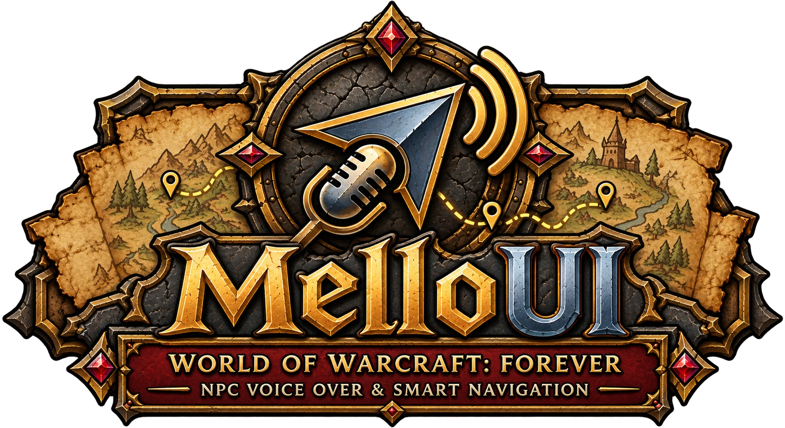
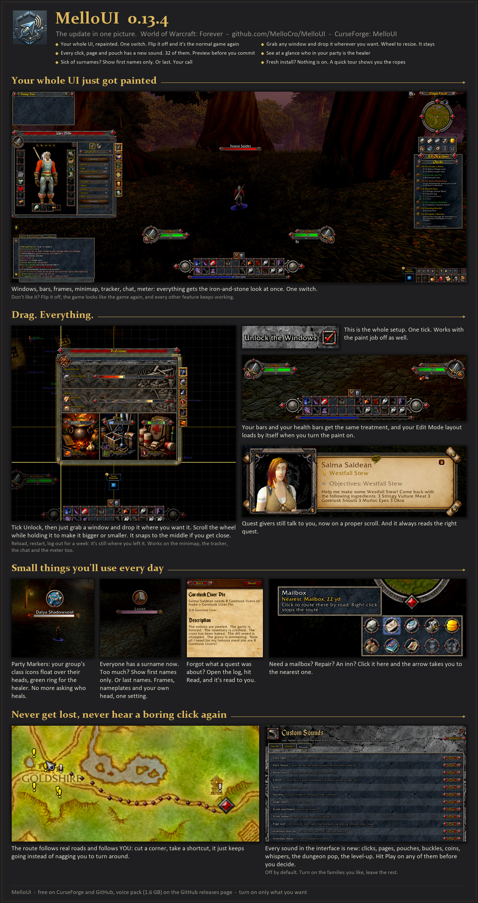

# MelloUI – Voiced NPCs, a Full UI Reskin & a Map That Actually Helps

**Download:** [latest release](https://github.com/MelloCro/MelloUI/releases/latest) · [on CurseForge](https://www.curseforge.com/wow/addons/melloui) · voice pack (2.5 GB, optional, two parts, remade for 0.18.3): [part 1](https://github.com/MelloCro/MelloUI/releases/download/v0.18.3/MelloUI_VoicePack_Part1.zip) + [part 2](https://github.com/MelloCro/MelloUI/releases/download/v0.18.3/MelloUI_VoicePack_Part2.zip) · [all releases](https://github.com/MelloCro/MelloUI/releases) · [changelog](CHANGELOG.md)

**Discord:** [discord.gg/gdpQ6ep7bW](https://discord.gg/gdpQ6ep7bW) · help, bug reports and every new release

*Hey! MelloUI is my all-in-one UI for World of Warcraft: Forever. Everything is a switch: a fresh install starts with nothing on, and on your first login the installer sets it up the way you pick (`/mello install` runs it again any time; `/mello` opens the settings).*

## What's in it

- **UI Reskin:** every window and bar in an Old-School RPG Look, with a soft shade round it.
- **Eight palettes:** Ember, Obsidian, Royal Azure and Fel Ember, each with a Vibrant version and its own painted kit.
- **Move anything:** drag and resize any window.
- **Voiced quest givers:** quests read out loud, with subtitles.
- **A map that helps:** quest list, pins, a route arrow and the nearest quest first in the tracker.
- **Reminders:** low supplies, new mail, worn gear, new training. One click shows the way; Restock refills your bags when you say Buy.
- **New UI sounds:** optional, with a preview for each.
- **And more:** party markers, names, bar textures, fonts, chat tweaks, auto-vendor, cooldown numbers, dark mode.

## Install

Download the [release zip](https://github.com/MelloCro/MelloUI/releases/latest) (not GitHub's "Source code" zip) and copy every folder in it, `MelloUI` and `MelloUI_Companion`, into `World of Warcraft\_classic_beta_\Interface\AddOns\`. Then restart the game fully once (`/reload` doesn't find new folders). `MelloUI_Companion` holds the Route data and only loads when a route needs it.

**Voice pack (optional, 2.5 GB in two parts, remade for 0.18.3):** download [part 1](https://github.com/MelloCro/MelloUI/releases/download/v0.18.3/MelloUI_VoicePack_Part1.zip) and [part 2](https://github.com/MelloCro/MelloUI/releases/download/v0.18.3/MelloUI_VoicePack_Part2.zip). Had an earlier voice pack? Delete its `MelloUI_VoicePack` folder first. Then unzip both parts into the same `AddOns` folder: they make one `MelloUI_VoicePack` folder next to MelloUI. Tick it in the addon list. It replaces the old `MelloUI_VoiceOverData` pack, so delete that one too. No pack? The game's text-to-speech reads instead.

## Good to know

- The game keeps your settings. Want an extra copy? Macro Backup on the Profiles page keeps one in account macros, brought back only when you ask.
- After an update, restart the game once. `/reload` isn't enough for new files.

## Links

[Discord](https://discord.gg/gdpQ6ep7bW) · [Changelog](CHANGELOG.md) · [Report a bug](https://github.com/MelloCro/MelloUI/issues) · [Every feature, command and module in detail](docs/GUIDE.md)
